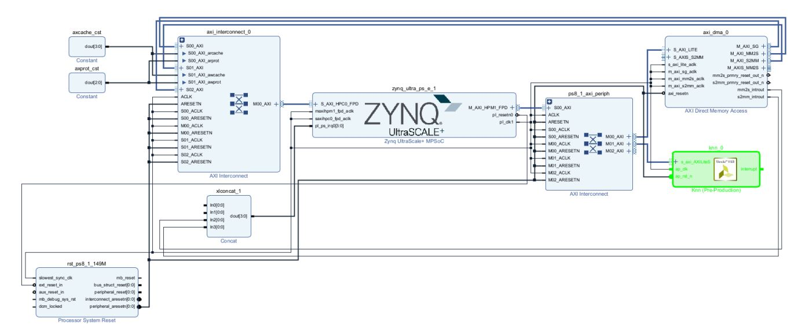
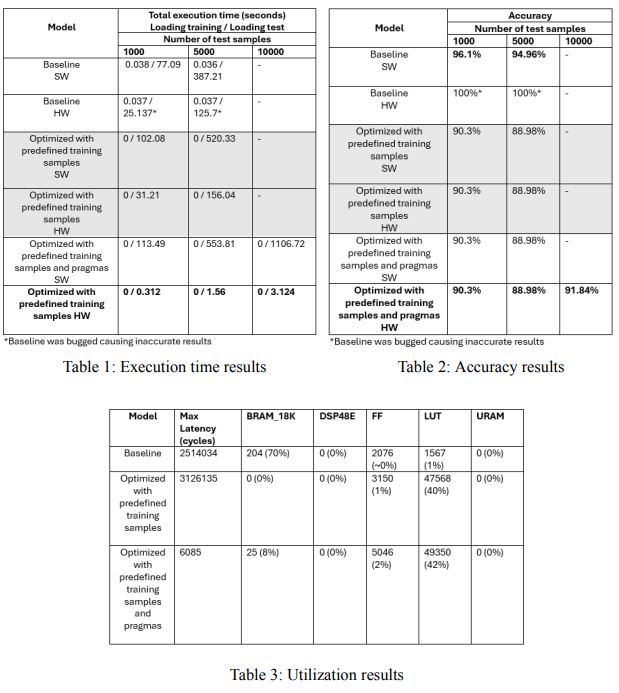

# Hardware Accelerated kNN

Fundamental areas in machine learning include handwritten digit identification and signature verification, with applications ranging from digital forensics to security systems. The objective of this project is to produce accurate and efficient handwritten verification by using the MNIST dataset and the k-Nearest Neighbours (kNN) algorithm. The main goals are to identify handwritten digits, accelerate the kNN algorithm with High-Level Synthesis (HLS), and enhance system performance. The project seeks to reduce computation time, enabling faster and more efficient processing of handwritten digit and signature data. By optimizing data types, and leveraging parallel processing capabilities, we aim to achieve high throughput and low latency.

  

<i>kNN Block Diagram</i>

## Results

Our accelerated kNN function demonstrates improved system performance with a 100x decrease in execution time at no loss in accuracy highlighting the effectiveness of accelerated HLS.

  

## Learn more

This project was created in collaboration with my team members Alex, Tony, and Arisa in COMP4601 24T2 Design Project B.

[Presentation](./assets/4601-knn.pdf)

[Report](./assets/4601project.pdf)

[Demo Video](https://www.youtube.com/watch?v=4KsrpWN4Mso)
